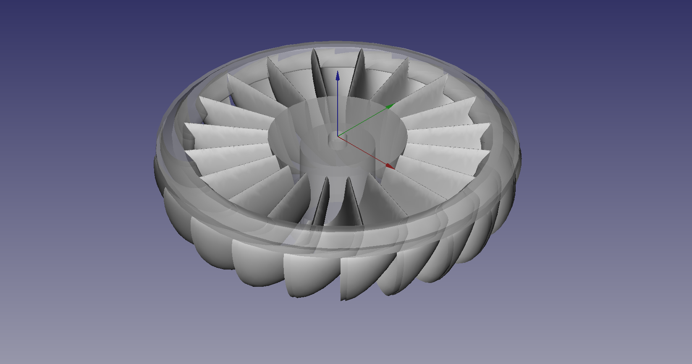
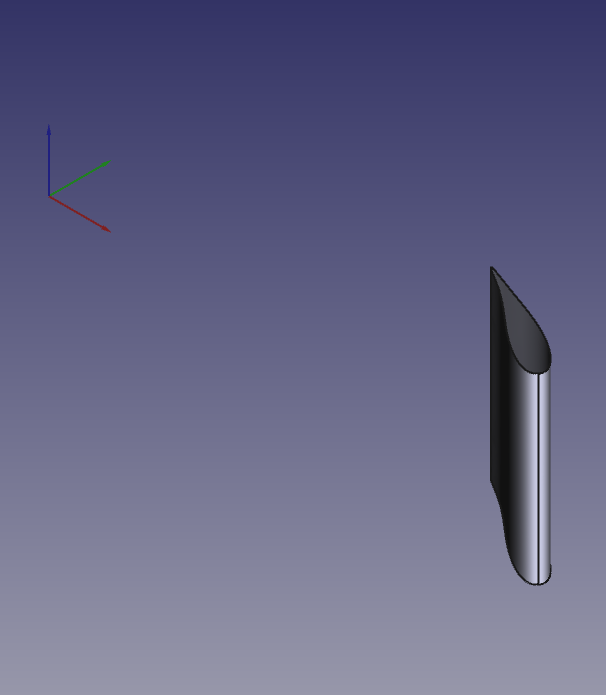

## FreeCAD Beltrami Workbench

Design a turbine blade profile within FreeCAD

## Usage

You always start from an existing design. Then you just have to modify it.
You can start from the original design nested in Beltrami or load an example that comes close to your goal.

## Documentation

A user manual can be found [online](https://michelsabourin.scenari-community.org/Outils/Manuel_utilisateur/co/Manuel_utilisateur.html) 

**Note:** All the documentation has been generated in French. However, your web browser translator works very well. MS Edge seems to have the best friendly translator.

Here is the video that presents the Beltrami workbench:
https://youtu.be/O_abwUuA4Ec

## Prerequisites

* FreeCAD v0.21.2 and higher
* FreeCAD [Curves workbench](https://github.com/tomate44/CurvesWB/) version 0.6.42 or higher. Available via the [Addon Manager](https://wiki.freecad.org/Std_AddonMgr).

## Installation

Beltrami workbench is available for install via the FreeCAD [Addon Manager](https://wiki.freecad.org/Std_AddonMgr).

For more details about the installation process reference the [manual](https://michelsabourin.scenari-community.org/Outils/Manuel_utilisateur/co/2_0_Installation.html).

## Theory

Background on the theory behind Beltrami can be found in [this section of the manual](https://michelsabourin.scenari-community.org/SimTurbMeth/co/0__Methode_de_trace.html).

## Examples

See the [Examples](https://github.com/Simturb/Beltrami/tree/main/Examples) section of this repository to find the provided examples of Beltrami in action.

### Francis Turbine Blades

### Kaplan Turbine Blades

### Centrifugal Pump Blades

### Turgo Turbine Blades

### Radial Cascade Blade

## Discussions/Feedback/Support

* Email contact: simturbweb@gmail.com
* Dedicated FreeCAD [forum thread](https://forum.freecadweb.org/viewtopic.php?f=8&t=62056)
* Bugs: https://github.com/Simturb/Beltrami/issues (please discuss on the forum thread beforehand)
* Dedicated YouTube channel/playlist [YouTube SimTurb/Beltrami](https://www.youtube.com/playlist?list=PLBEuUSiaphy0sQsR1XlUFJ3OMMKjDw_Wx)

## Licence

Beltrami workbench is released under the LGPL2.1+ licence. See [LICENSE](LICENSE) file.

## Warning

This Beltrami workbench is in ALPHA state along with the [Curves WB](https://github.com/tomate44/CurvesWB/) on which it is based.
With new release, reading of previous release generated file can present some bugs. To correct de situation, cold start a new file, import manually the coordinates in the Meridien sketch and do the same for variables in the Tableau_Pilote spreadsheet.

  
Release notes

  
    ### Release 1.1 :
    Release 0.6.40 of CurvesWB allows to some bugs to popup: corrected.
    For issue "Add support for translation of the strings", for the moment I removed the french translation. All is in English now. Code for translation are already incoporated. Waiting for translation files.

    ### Release 1.0.8.1 :
    -Internal code for B-spline modified, Radius replaced by Weight, initial Weight is now 1 adimensional.
    -Variables in Tableau_pilote displaced and modified accordingly, variables Poids_entree and Poids_sortie.

    ### Release 1.0.8 : 
    - Implements surfaces with better tangent continuity at leading edge. 
    - Modifies slightly user interface (some names are changed)
    - Solves minor bugs
    - Optimises the structure of the code
    - Previous files are not compatible. From Interface_Usager, you simply have to transfer data from the sketch Meridien (12 2D points) and the spreadsheet Tableau_Pilote (copy-paste). And, of course transfer data from the FeaturePython Parametres.
    - Be sure to update Curves WB

