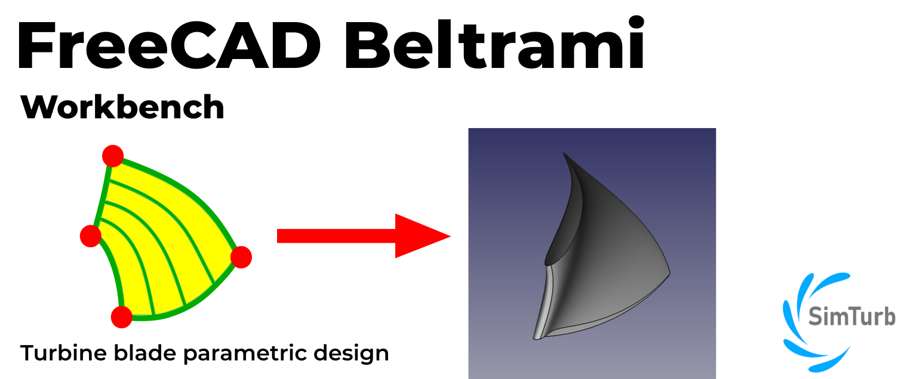
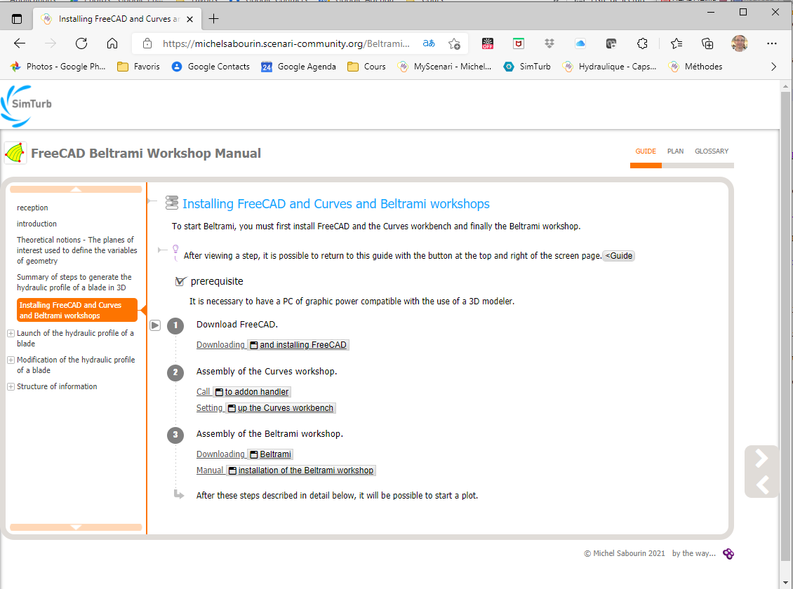
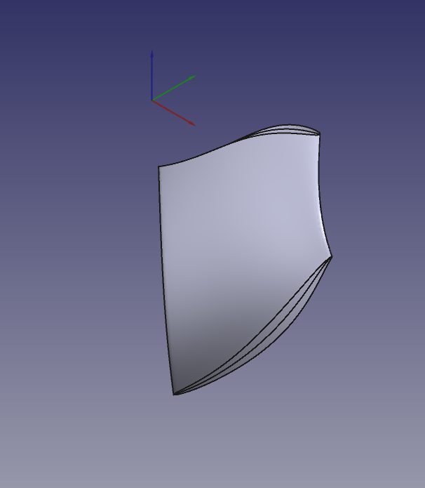
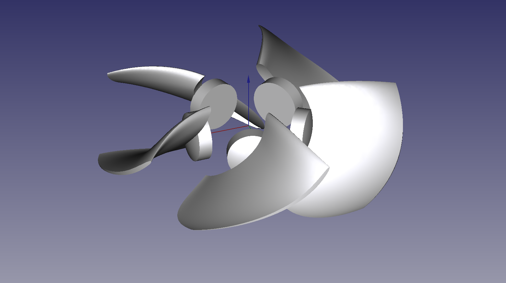

## FreeCAD Beltrami Workbench
Design a turbine blade profile.

## Usage
You always start from an existing design. Then you just have to modify it.
You can start from the original design nested in Beltrami or load an example that comes close to your goal.

## Documentation
User manual can be found here: https://michelsabourin.scenari-community.org/Outils/Manuel%20utilisateur%20de%20l'atelier%20Beltrami/co/0_Manuel_utilisateur.html

**Note:** All the documentation has been generated in French. However, your web browser translator works very well. MS Edge seems to have the best friendly translator.

## Installation
https://michelsabourin.scenari-community.org/Beltrami%20-%20Manuel_utilisateur/co/2_InstallationFreeCAD.html

## Theory
https://michelsabourin.scenari-community.org/SimTurbMeth/co/0_1_Methode_de_trace.html

## Examples
Under https://github.com/Simturb/Beltrami/tree/main/Examples your find few examples provided.

### Francis turbine blades

### Kaplan turbine blades

### Centrifugal pump blades

## Discussions, exchanges and support

* Email contact: simturbweb@gmail.com
* Dedicated FreeCAD [forum thread](https://forum.freecadweb.org/viewtopic.php?f=8&t=62056)

## Licence
Beltrami workbench is released under the LGPL2.1+ licence. See [LICENSE](LICENSE) file.

## Warning
This Beltrami workbench is in ALPHA state along with the [Curves WB](https://github.com/tomate44/CurvesWB/) on which it is based.
